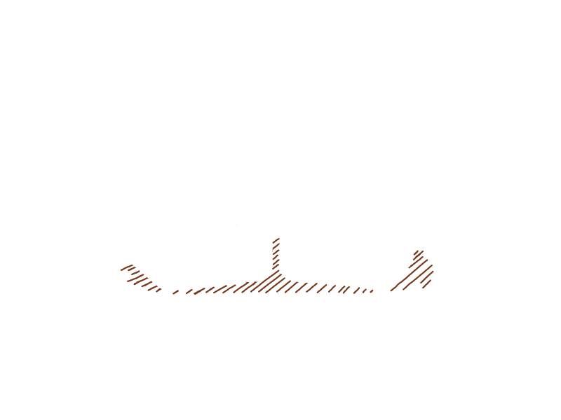

  <picture> 
    <source media="(prefers-color-scheme: dark)" srcset=".github/assets/cubeABC-light.png" /> 
    <source media="(prefers-color-scheme: light)" srcset=".github/assets/cubeABC-dark.png" />
	  
  </picture> 

  <a href="https://github.com/Ercaino/ABC_Languages">ABC Hello project</a>

<h6 align="center">
  <a href="https://github.com/Ercaino/ABC_Languages/blob/main/README.md">Description</a>
  ·
  <a href="https://github.com/Ercaino/ABC_Languages/tree/main/scr">Src</a>
  ·
  <a href="https://github.com/Ercaino/ABC_Languages/wiki">Wiki</a>
  ·
  <a href="https://github.com/Ercaino/ABC_Languages/blob/main/README.md">Docs</a>
  ·
  <a href="https://github.com/Ercaino/ABC_Languages/blob/main/LICENSE">License</a>
</h6>

---

 

  
  

